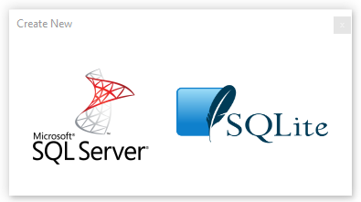
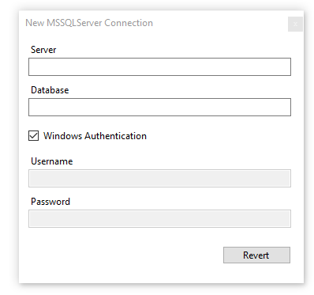
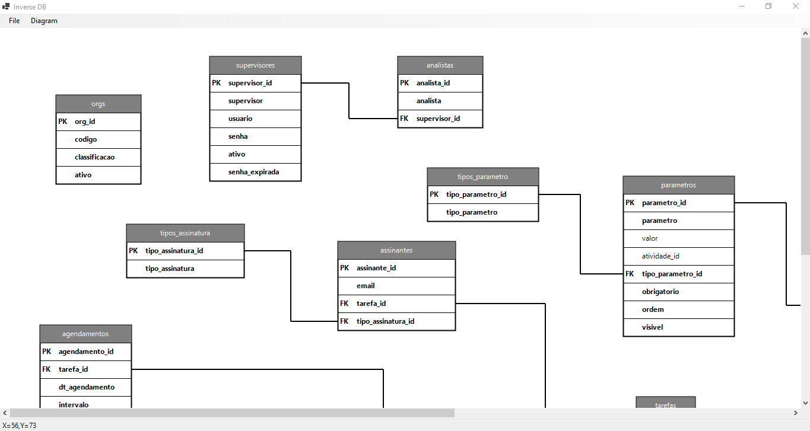
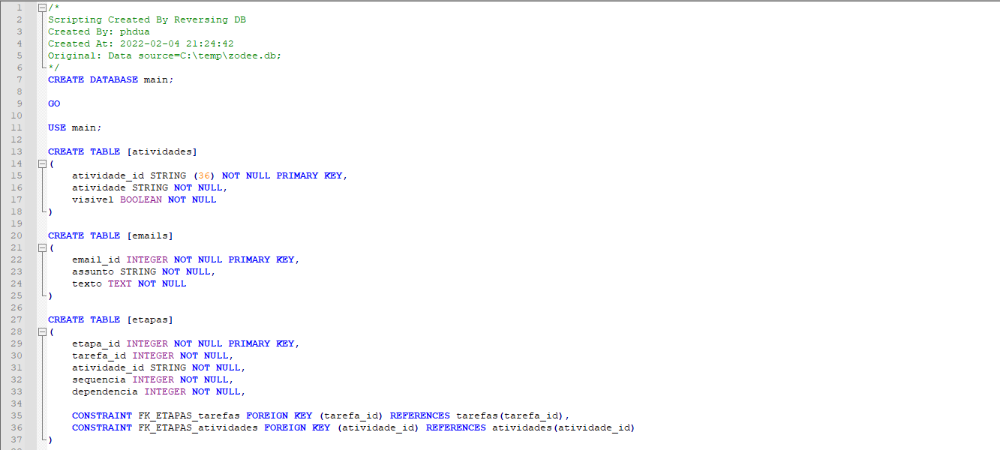

# Inverse DB

Sistema de Engenharia Reversa de Banco de Dados compatível com SQLite e SQL Server

## Uso

Escolha qual o tipo de provedor de banco de dados o banco está sendo executado:

Informe os dados de conexão, no caso abaixo, para uma conexão com SQL Server é necessário informar o servidor e o nome do banco de dados.

Na tela principal do sistema é possivel mover as tabelas e organizar a visualização do diagrama. Após terminar é possível salvar o diagrama para continuar mais tarde.

Também é possível exportar o diagrama para arquivo de script `.SQL`. Isso facilita por exemplo a recriação da estrutura do banco de dados em outro servidor ou ambiente.

## Requisitos mínimos:

- Windows 7+, Linux
- Processador 1 GHz
- RAM 512MB
- .NET 6 Runtime

## Requisitos (DEV):

- VS Code ou Visual Studio 2022 versão 17.0 ou superior
- SDK Windows Forms .NET 6
- Linguagem C# versão 10.0
- xUnit 2.5.0+
- FakeItEasy 7.4+
